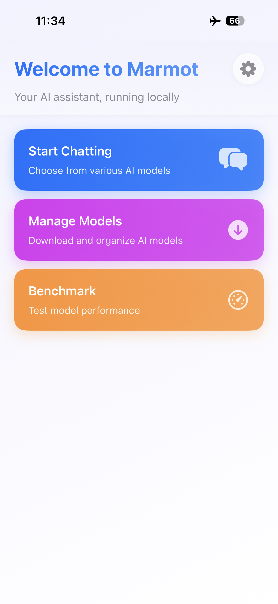
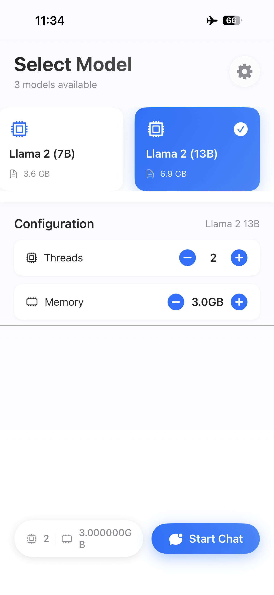
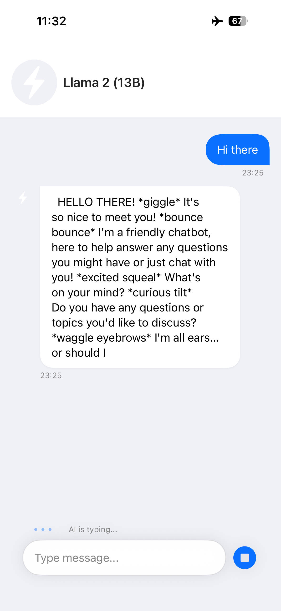
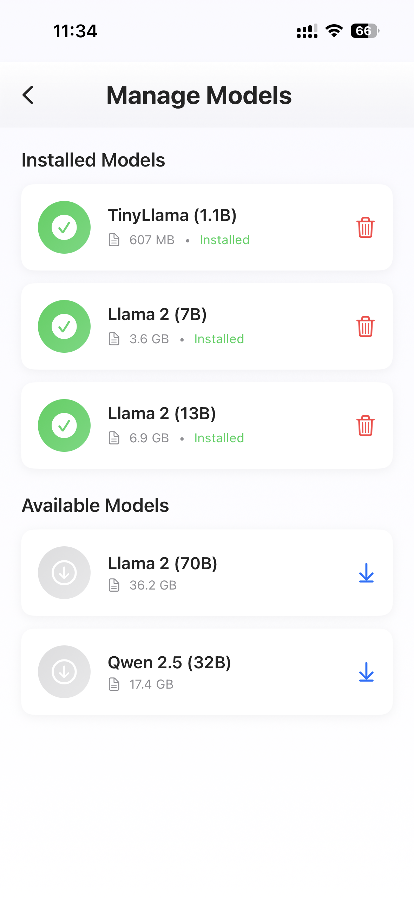
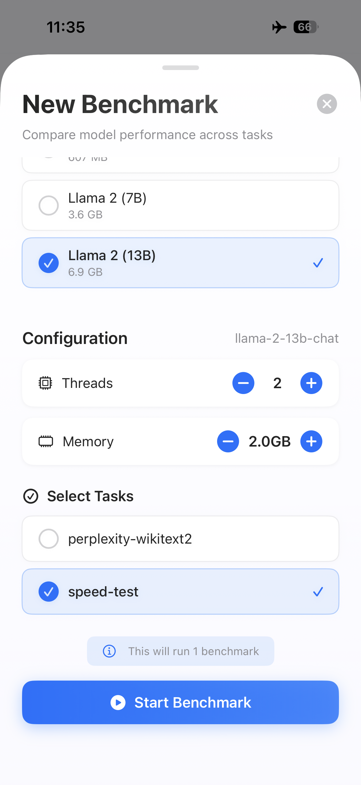
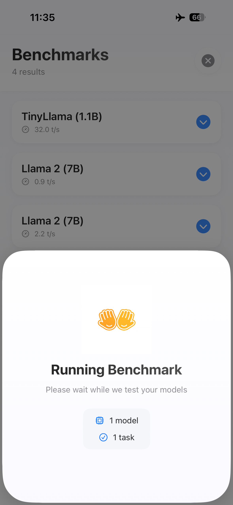
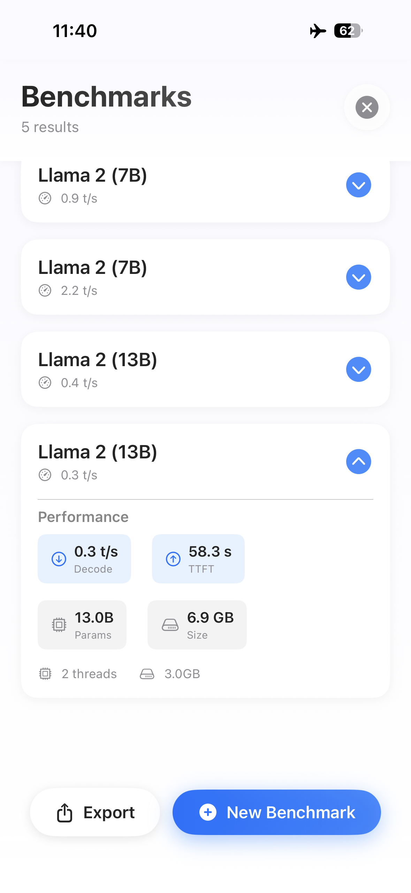

<div align="center">

# MarmotApp

[](https://github.com/MarmotTech/MarmotApp/blob/master/LICENSE)
[](https://github.com/MarmotTech/MarmotApp)

[](https://forms.gle/eykCnWKzifPUJTPs7)
[](https://github.com/MarmotTech/MarmotApp/tree/master/andriod)
[](https://github.com/MarmotTech/MarmotApp/tree/master/host)

**Enable running any large language models locally and privately.**

</div>

# About

MarmotApp is a cutting-edge application that enables users to run any large language models locally on their devices, ensuring complete privacy and offline functionality. Our solution brings powerful AI capabilities to your fingertips without compromising data security.

# Preview
<div style="position: relative; width: 100%; max-width: 200px; margin: 20px auto; overflow: hidden; border-radius: 12px; box-shadow: 0 8px 32px rgba(0,0,0,0.1);">
    <div style="display: flex; overflow-x: auto; scroll-snap-type: x mandatory; scroll-behavior: smooth; -webkit-overflow-scrolling: touch;">
        <div style="flex: 0 0 auto; width: 100%; scroll-snap-align: start;">
            
        </div>
        <div style="flex: 0 0 auto; width: 100%; scroll-snap-align: start;">
            
        </div>
        <div style="flex: 0 0 auto; width: 100%; scroll-snap-align: start;">
            
        </div>
        <div style="flex: 0 0 auto; width: 100%; scroll-snap-align: start;">
            
        </div>
        <div style="flex: 0 0 auto; width: 100%; scroll-snap-align: start;">
            
        </div>
        <div style="flex: 0 0 auto; width: 100%; scroll-snap-align: start;">
            
        </div>
        <div style="flex: 0 0 auto; width: 100%; scroll-snap-align: start;">
            
        </div>
    </div><!-- Navigation Dots -->
</div>

# 🚀 Quick Start

## 📱 iOS - Ready for Testing

Our iOS app is available through [TestFlight](https://apps.apple.com/us/app/testflight/id899247664) for beta testing.

To join the beta:

1. Fill out our [Beta Tester Form](https://forms.gle/eykCnWKzifPUJTPs7).

2. We'll send a TestFlight invitation to your Apple ID email.

3. Install via TestFlight and start using locally!

> Note: No App Store download required - direct TestFlight access.

The source codes for building iOS applications can be found in [ios directory](https://github.com/MarmotTech/MarmotApp/tree/master/ios).

## 🤖 Android - Libraries Available
We currently provide pre-built executable files and corresponding libraries for Android. *A full Android app is coming soon.*

### Setup via ADB
Push executable files and corresponding libraries to Android device.
```bash
adb push android /data/local/tmp
adb push ggml-model-llama-2-7b-chat-q4_0.gguf /data/local/tmp
```

Connect to device shell.
```bash
adb shell
```

### Current Features
**Text generation**
```bash
cd /data/local/tmp
LD_LIBRARY_PATH=android/lib/ ./android/bin/llama-cli-prefetch -m ggml-model-llama-2-7b-chat-q4_0.gguf -p "I believe the meaning of life is" -n 128 -t 4 -am 2 -tp 1 -c 512 -ngl 0
```

> Parameters: 
> 1. `-m`: model path
> 2. `-p`: prompt, if the prompt contains some special characters, we can use `-f` to indicate the file that contains the prompt
> 3. `-n`: the number of tokens to generate
> 4. `-t`: the number of computing threads
> 5. `-am`: the available memory size
> 6. `-tp`: the number of I/O threads
> 7. `-c`: the context size
> 8. `-ngl`: the number of layers computed on GPU (must set to 0, prefetching on GPU is not supported so far)

**Chatting**

```bash
cd /data/local/tmp
LD_LIBRARY_PATH=android/lib/ ./android/bin/llama-cli-prefetch -m ggml-model-llama-2-7b-chat-q4_0.gguf -p "Your are a helpful assistant" -n 128 -t 4 -am 2 -tp 1 -c 512 -ngl 0 --cnv
```

> Parameters: 
> 1. `-p`: system prompt, if the system prompt contains some special characters, we can use `-spf` to indicate the file that contains the system prompt
> 2. `-cnv`: conversation mode
> 
> other parameters are the same as the above

**Speed Benchmarking**

```bash
cd /data/local/tmp
LD_LIBRARY_PATH=android/lib/ ./android/bin/llama-bench -m ggml-model-llama-2-7b-chat-q4_0.gguf -p 16 -n 16 -t 4 -am 2 -tp 1 -ngl 0
```

> Parameters: 
> 1. `-p`: the prompt length for benchmarking
> 2. `-n`: the generation length for benchmarking
> 
> other parameters are the same as the above

## 🖥️ Desktop - Executable Ready

We also provides executable files and corresponding libraries to serve LLMs directly on your host machine.

### Current Features
**Text generation**
```bash
LD_LIBRARY_PATH=host/lib/ ./host/bin/llama-cli-prefetch -m ggml-model-llama-2-7b-chat-q4_0.gguf -p "I believe the meaning of life is" -n 128 -t 4 -am 2 -tp 1 -c 512 -ngl 0
```

**Chatting**

```bash
LD_LIBRARY_PATH=host/lib/ ./host/bin/llama-cli-prefetch -m ggml-model-llama-2-7b-chat-q4_0.gguf -p "Your are a helpful assistant" -n 128 -t 4 -am 2 -tp 1 -c 512 -ngl 0 --cnv
```

**Speed Benchmarking**

```bash
LD_LIBRARY_PATH=host/lib/ ./host/bin/llama-bench -m ggml-model-llama-2-7b-chat-q4_0.gguf -p 16 -n 16 -t 4 -am 2 -tp 1 -ngl 0
```

# Todo List
- [ ] Release Android application.
- [ ] Supporting prefetching techniques on GPU
    - [ ] Mail GPU
    - [ ] Metal GPU
- [ ] Supporting chatting history management
- [ ] Supporting more downstream task

# Citations
Please consider citing our project if you find it useful:
```bibtex
@software{marmotapp,
    author = {{MarmotTech}},
    title = {{MarmotApp}},
    url = {https://github.com/MarmotTech/MarmotApp},
    year = {2025}
}
```

The underlying techniques of MarmotApp include:

```bibtex
@inproceedings{euromlsys-flexinfer,
    author       = {Hongchao Du and
                    Shangyu Wu and
                    Arina Kharlamova and
                    Nan Guan and
                    Chun Jason Xue},
    editor       = {Eiko Yoneki and
                    Amir H. Payberah},
    title        = {FlexInfer: Breaking Memory Constraint via Flexible and Efficient Offloading
                    for On-Device {LLM} Inference},
    booktitle    = {Proceedings of the 5th Workshop on Machine Learning and Systems, EuroMLSys
                    2025, World Trade Center, Rotterdam, The Netherlands, 30 March 2025-
                    3 April 2025},
    pages        = {56--65},
    publisher    = {{ACM}},
    year         = {2025},
    url          = {https://doi.org/10.1145/3721146.3721961},
    doi          = {10.1145/3721146.3721961},
}
```